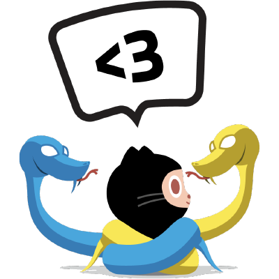

<h1 align="center">
  <br>
  Interactive-Fiction-Py
</h1>

<p align="center"> Interactive fiction Game written in python only using standard library.</p>
<p align="center"> 
  
  
  
  
</p>

<br>
<br>

### ⚙️ USAGE


```sh
#clone the repo.
git clone https://github.com/pawarashish564/Interactive-Fiction-Py.git
#run the game.
python game.py
```

### 📦 Modules used 

* shutil
* json
* tempfile
* cmd
* textwrap
* sqlite3

<!-- ## Gotchas -->

### 📄 Bug reports, feature requests, etc

This is an ongoing project and I welcome contributions and suggestions! Feel free to submit a PR.
